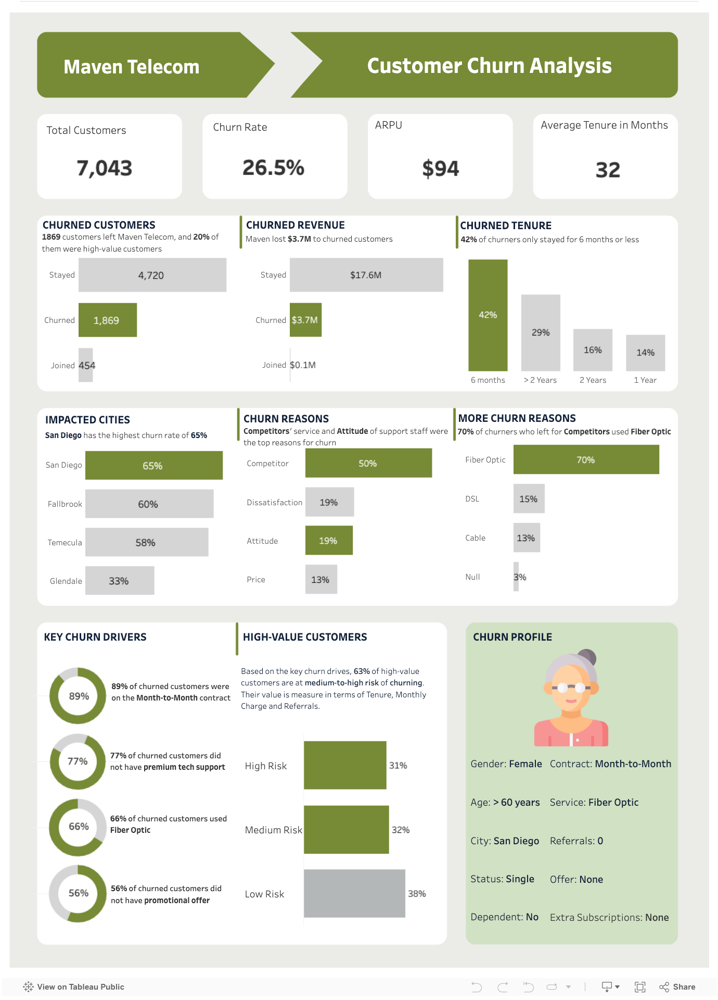

The telecom industry is fiercely competitive, with customers having numerous choices. Retention is crucial for sustained growth and success. While some customer churn is unavoidable, a data-driven approach can help Maven Telecom minimize its impact. This report analyzes customer churn data to answer key questions and identify actionable recommendations:

- **Key Churn Drivers:** Identify the factors most strongly associated with customer churn.
- **High-Value Customer Loss:** Assess the prevalence of high-value customer churn and propose strategies for their retention.
- **Churning Customer Profile:** Define the characteristics of customers most likely to churn.
- **Churn Reduction Strategies:** Recommend concrete actions to minimize churn.


### Project Strategy
The analysis utilized data retrieved from Maven Analytics, encompassing customer demographics, subscription plans, and account history. SQL performed data cleaning and manipulation, with corresponding code provided below. Tableau and Canva were used for visualizations and dashboard creation, respectively.

The main steps for this project are:

- Data Cleaning and Preparation
    
- Exploratory Data Analysis
    
- Building the Ideal Churn Profile
    
- Data Insights
    
- Customer Retention Strategies
    
- Data Visualisation
    

  
## Data Cleaning and Preparation

Some information in the dataset might be missing because customers don't always use all features or provide every detail. We've kept this information as it reflects real-world customer behavior and avoids potentially biasing results. 

Duplicate entries (customers with the same ID) were checked and none were found.
``` sql
--Check for duplicates--
SELECT Customer_ID, COUNT(Customer_ID)
FROM telecom_customer_churn
GROUP BY Customer_ID
HAVING COUNT(Customer_ID) > 1;
```

## Exploratory Analysis

There are 7043 customers in total.


``` sql
-- Find total number of customers
SELECT COUNT(Customer_ID) AS Total_Customer
FROM telecom_customer_churn;
```


1. **How much revenue was lost to churned customers?**

Maven lost 1869 customers and they accounted for 17% of Maven’s total revenue. It’s a pretty significant figure and I will analyze the reasons behind this churn in the following sections
``` sql 
-- How much revenue did Maven lose to churned customers?
SELECT 
Customer_Status, 
COUNT(Customer_ID) AS Customer_Count,
ROUND((SUM(Total_Revenue) * 100) / SUM(SUM(Total_Revenue)) OVER(),1) AS Revenue_Percentage 
FROM telecom_customer_churn
GROUP BY Customer_Status;
```


**2. What’s the typical tenure for churned customers?**

Using SQL's CASE statement, We've classified churned customers based on their tenure at Maven. This analysis revealed that **approximately 42%** of churned customers left within **6 months** of subscribing. This finding suggests significant potential for improvement in **customer retention among newer customers**. 

``` sql
-- Typical tenure for churners
SELECT
	CASE
		WHEN Tenure_in_Months <= 6 THEN '6 months'
		WHEN Tenure_in_Months <= 12 THEN '1 Year'
		WHEN Tenure_in_Months <= 24 THEN '2 Years'
		ELSE '> 2 Years'
	END AS Tenure,
ROUND(COUNT(Customer_ID) * 100/ SUM(COUNT(Customer_ID)) OVER(),1) AS Churn_Percentage
FROM telecom_customer_churn
WHERE Customer_Status = 'Churned'
GROUP BY
	CASE
		WHEN Tenure_in_Months <= 6 THEN '6 months'
		WHEN Tenure_in_Months <= 12 THEN '1 Year'
		WHEN Tenure_in_Months <= 24 THEN '2 Years'
		ELSE '> 2 Years'
	END
ORDER BY Churn_Percentage DESC;
```


**3. Which cities had the highest churn rates?**

We calculated the churn rate, the percentage of customers who discontinue service within a specific timeframe, for various cities. However, to avoid skewed results due to small sample sizes, we only analyzed cities with at least 30 customers. San Diego stood out with the highest churn rate, reaching **65%**, indicating that over half of its customers stopped using Maven's services.

```sql
-- Which cities have the highest churn rates?
SELECT
	City,
	COUNT(Customer_ID) AS Churned,
	CEILING(COUNT(CASE WHEN Customer_Status = 'Churned' THEN Customer_ID ELSE NULL END) * 100.0 / COUNT(Customer_ID)) AS Churn_Rate
FROM telecom_customer_churn
GROUP BY City
HAVING COUNT(Customer_ID) > 30
AND COUNT(CASE WHEN Customer_Status = 'Churned' THEN Customer_ID ELSE NULL END) > 0
ORDER BY Churn_Rate DESC
LIMIT 4;
```


**4. What are the general reasons for churn?**

**45%** of churned customers stated **‘Competitor’** as their reason for leaving. It’s interesting to note that a significant number of customers **(17%)** left due to the **attitude** of support staff. Maven also lost about **$1.7 million** to **Competitors**, making it the most expensive type of churn.

```sql 
-- Why did customers leave?
SELECT
	Churn_Category,
	ROUND(SUM(Total_Revenue),0)AS Churned_Rev,
	CEILING((COUNT(Customer_ID) * 100.0) / SUM(COUNT(Customer_ID)) OVER()) AS Churn_Percentage
FROM
	telecom_customer_churn
WHERE
	Customer_Status = 'Churned'
GROUP BY
	Churn_Category
ORDER BY
	Churn_Percentage DESC;
```


**5a. Specific reasons for churn**

The top 3 reasons for churn are ‘Competitor made **better offer**’, ‘Competitor had **better devices**’ and ‘**Attitude** of support person’.

``` sql
-- why exactly did customers churn?
SELECT
	Churn_Reason,
	Churn_Category,
	ROUND(COUNT(Customer_ID) *100 / SUM(COUNT(Customer_ID)) OVER(), 1) AS churn_percentage
FROM
	telecom_customer_churn
WHERE
	Customer_Status = 'Churned'
GROUP BY
	Churn_Reason,
	Churn_Category
ORDER BY churn_percentage DESC
LIMIT 5;
```


**5b. What offers did churned customers have?**

56% of churners did not have any promotional offer while 23% had **Offer E**. Offers are a great way to reward and retain your loyal customers.

``` sql
-- What offers did churners have?
SELECT
	Offer,
	ROUND(COUNT(Customer_ID) * 100.0 / SUM(COUNT(Customer_ID)) OVER(), 1) AS churned
FROM
	telecom_customer_churn
WHERE
	Customer_Status = 'Churned'
GROUP BY
	Offer
ORDER BY
	churned DESC;
```


**5c. What internet type did churners have?**

**66%** of all churned customers used **Fiber Optic**. While ~**70%** of customers who left for competitors also used **Fiber Optic**. Maven should review the quality and service of their Fiber Optic internet, as this could be the reason customers are leaving to competitors.

```sql
-- What Internet Type did churners have?
SELECT
	Internet_Type,
	COUNT(Customer_ID) AS Churned,
	ROUND(COUNT(Customer_ID) * 100.0 / SUM(COUNT(Customer_ID)) OVER(), 1) AS Churn_Percentage
FROM
	telecom_customer_churn
WHERE
	Customer_Status = 'Churned'
GROUP BY
	Internet_Type
ORDER BY
	Churned DESC;
 
-- What Internet Type did 'Competitor' churners have?
SELECT
	Internet_Type,
	Churn_Category
	ROUND(COUNT(Customer_ID) * 100.0 / SUM(COUNT(Customer_ID)) OVER(), 1) AS Churn_Percentage
FROM
	telecom_customer_churn
WHERE
	Customer_Status = 'Churned'
AND Churn_Category = 'Competitor'
GROUP BY
	Internet_Type,
	Churn_Category
ORDER BY Churn_Percentage DESC;
```


**5d. Did churners have premium tech support?**

**77%** of churned customers did **not** have premium tech support. It’s possible that this service could have improved their after-sales experience and reduced churn.

``` sql
-- Did churners have premium tech support?
SELECT
	Premium_Tech_Support,
	COUNT(Customer_ID) AS Churned,
	ROUND(COUNT(Customer_ID) *100.0 / SUM(COUNT(Customer_ID)) OVER(),1) AS Churn_Percentage
FROM
	telecom_customer_churn
WHERE
	Customer_Status = 'Churned'
GROUP BY Premium_Tech_Support
ORDER BY Churned DESC;
```


**5e. What contract were churners on?**

Almost all churned customers (89%) were on the **month-to-month** contract.

Customers on a month-to-month contract are more likely to churn, as they have greater flexibility to cancel or switch providers without incurring any penalty.
```sql
-- What contract were churners on?
SELECT
	Contract,
	COUNT(Customer_ID) AS Churned,
	ROUND(COUNT(Customer_ID) * 100.0 / SUM(COUNT(Customer_ID)) OVER(), 1) AS Churn_Percentage
FROM
	telecom_customer_churn
WHERE
	Customer_Status = 'Churned'
GROUP BY
	Contract
ORDER BY
	Churned DESC;
```


The **key churn indicators** are therefore:

- **Contract**: 89% of churned customers were on the month-to-month contract
- **Premium Tech Support**: 77% of churners did not have premium tech support
- **Internet Type:** 66% of churners used Fiber Optic internet
- **Offer:** 56% of churners did not have any promotional offers, while 23% had Offer E.
-

**6. Are high value customers at risk of churning?**

I defined high value customers based on these factors and grouped them into 3 risk levels (High, Medium, Low):

- **Tenure:** Customers who have been with Maven for at least **9 months**, indicating a level of loyalty.
- **Monthly Charge:** Customers whose monthly bill falls within the **top 50%** percentile, signifying higher revenue contribution.
- **Referrals:** Customers who have referred **other customers** to Maven, demonstrating brand advocacy.

These high-value customers were then categorized into three risk groups based on the number of "churn indicators" they exhibited:

- **High Risk (3-4 indicators):** These customers require immediate attention as they are most likely to churn. They might use fiber optic internet, have a month-to-month contract, lack promotional offers, and lack premium tech support.
- **Medium Risk (2 indicators):** These customers warrant proactive engagement to mitigate their churn risk.
- **Low Risk (1 indicator):** These customers are less likely to churn but should still be monitored.


Over half of (63%) high-value customers are at a medium-to-high risk of churning. 

**7. Building the ideal churn customer profile**

I built a simple churn profile using the key churn indicators I discussed in previous sections, and the churn demographic results below:

- **32%** of churned customers are **above** **60** years old
- **~50%** of churned customers are **Female**
- **64%** of churned customers are **Single**
- **94%** of churned customers have **no dependents** in their household; it’s possible they have more flexibility and fewer commitments, making it easier for them to switch providers or cancel their subscription.
- 
You can view the sql codes for the demographic results  [View](https://github.com/carinaau/Cayla_Notebook/blob/main/Customer%20Churn%20Analysis%20%20_%20SQL.md)


## 8. Insights

- Maven experienced churn of 1869 customers and 20% of them are high-value customers.
- 42% of churned customers only stayed for 6 months or less,  suggesting opportunities for early engagement improvement.
- The top 3 reasons for churn are competitors made better offers, competitors had better devices and attitude of support staff.
- Maven lost ~$1.7 million to competitors, making it the most expensive type of churn
- The key indicators of churn are Month-to-Month contract , No Premium Tech Support, Fiber Optic internet, No promotional offer and Offer E.
- 70% of customers who churned to competitors used fiber optic internet**, indicating a potential need for service improvement in this segment.
- Based on the key churn indicators, out of 1250 high-value customers remaining, 63% are at medium-to-high risk of churning.

## 9. Customer Retention Strategies

**a. Combat Competitive Offers:**
- **Implement loyalty programs:** Offer exclusive discounts, free upgrades, or additional features to customers on long-term contracts.
- **Analyze competitor offerings:** Regularly assess competitor packages to ensure Maven's pricing and features remain competitive.

**b. Enhance Customer Support:**
- **Invest in staff training:** Equip support staff with the knowledge and skills to deliver exceptional service and address customer concerns effectively.
- **Implement feedback mechanisms:** Gather and analyze customer feedback to identify areas for improvement and implement changes accordingly.

**c. Evaluate Device Offerings:**
- **Benchmark against competitors:** Continuously assess competitors' devices in terms of features, performance, and pricing to ensure Maven's offerings are attractive.
- **Consider device upgrades or partnerships:** Explore opportunities to improve device offerings through potential upgrades or strategic partnerships.

**d. Expand Premium Tech Support:**
- **Offer premium tech support to all customers:** Consider extending this service to all customers, potentially at tiered levels to cater to different needs and budgets.

**e. Optimize Fiber Optic Services:**
- **Invest in infrastructure and support:** Prioritize improving fiber optic service quality by focusing on faster speeds, increased stability, and enhanced customer support specifically for fiber optic users.

**f. Prioritize High-Value Customer Engagement:**
- **Implement targeted communication:** Develop personalized offers and communications tailored to the specific needs and preferences of high-value customers.
- **Provide dedicated support:** Offer high-value customers access to premium tech support and dedicated contact channels.


## 10. Final Dashboard (Tableau)




